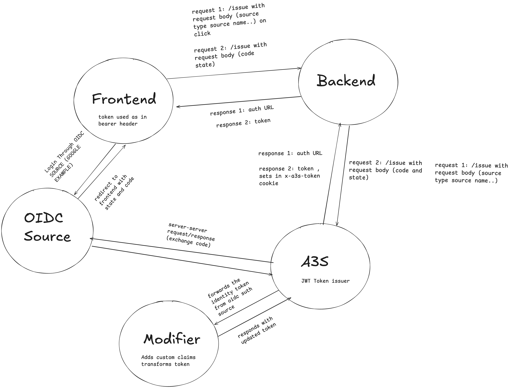
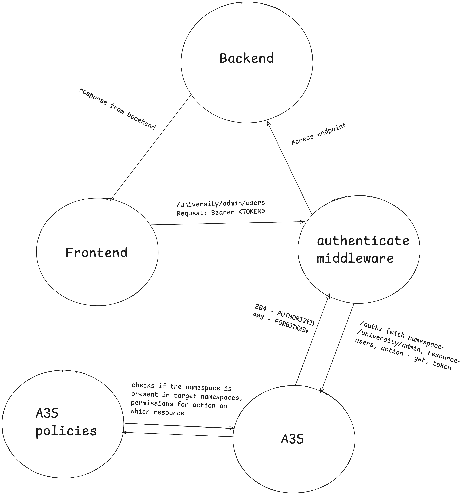

# A3S University Portal Demo

This repository contains a demonstration of the Auth-as-a-Service (A3S) platform integrated with a university portal application. The demo showcases authentication and authorization capabilities using A3S.

---

## What is A3S?

> **NOTE:** This is a work in progress.

**A3S (Auth As A Service)** is an authentication and ABAC (Attribute-Based Access Control) authorization server. It enables normalization of diverse authentication sources (OIDC, AWS/Azure/GCP tokens, LDAP, etc.) into a generic identity token composed of **claims** instead of scopes. These claims are evaluated through authorization policies to determine user access across a hierarchical namespace model.

---

## Quick Start

### 1. Clone the Repository

```bash
git clone https://github.com/yourusername/a3s-university-demo.git
cd a3s-university-demo
```

### 2. Install Tools for A3S Development

Install the required development tools:

```bash
go install go.aporeto.io/tg@master
go install go.aporeto.io/elemental/cmd/elegen@master
go install go.aporeto.io/regolithe/cmd/rego@master
go install github.com/aporeto-inc/go-bindata/go-bindata@master
```

### 3. Generate Certificates

```bash
dev/certs-init
```

This generates the necessary certificates into `dev/.data/certificates`, which will be mounted by the A3S container.

### 4. Build Docker Container

```bash
make docker
```

> Note: You might need to change Node and TypeScript versions in the A3S-provided UI and system files (`internal/ui`). Also install any missing dependencies manually if errors occur during setup.

You may also need to download Mozilla's certificate data:

```bash
curl -s https://hg.mozilla.org/mozilla-central/raw-file/tip/security/nss/lib/ckfw/builtins/certdata.txt -o certdata.txt
```

**Mozilla CA Certificates Info:** [Mozilla NSS certdata.txt reference](https://hg.mozilla.org/mozilla-central/file/tip/security/nss/lib/ckfw/builtins/certdata.txt)

### 5. Start A3S with Docker Compose

```bash
cd /dev
docker compose up
```

---

## Using the System

### Install `a3sctl` CLI

```bash
make cli
```

This installs `a3sctl` into your `$GOBIN` folder. Make sure `$GOBIN` is in your `$PATH` for easy CLI access.

---

## University Portal Demo Setup

### 1. Make Scripts Executable (Execute from root example:- /A3S)

```bash
chmod +x init-main.sh setup-namespaces.sh setup-policies.sh  gencerts.sh setenv.sh
```

### 2. Initialize the A3S Configuration

```bash

./init-main.sh
```

This script will:

-   Set up environment variables
-   Generate necessary certificates
-   Create namespaces for the university portal
-   Configure OIDC authentication sources
-   Set up authorization policies

---

# Setting Up Local SSL Certificates

This guide explains how to generate self-signed SSL certificates for local development using `mkcert`. These certificates will allow you to run your application with HTTPS locally without browser security warnings. Do check and verify the commands for your system

## Installation

<details>
<summary>macOS</summary>

```bash
brew install mkcert
brew install nss
```

</details>

<details>
<summary>Linux</summary>

### Debian/Ubuntu

```bash
sudo apt update
sudo apt install libnss3-tools wget
wget https://github.com/FiloSottile/mkcert/releases/download/v1.4.3/mkcert-v1.4.3-linux-amd64
sudo mv mkcert-v1.4.3-linux-amd64 /usr/local/bin/mkcert
sudo chmod +x /usr/local/bin/mkcert
```

### Manual

1. Download from [mkcert Releases](https://github.com/FiloSottile/mkcert/releases)
2. Rename the binary to `mkcert.exe`
3. Add to your PATH

</details>

## Generate Certificates

```bash
mkcert -install
mkdir -p ProjectFiles/frontend/ssl
mkdir -p ProjectFiles/backend/ssl
mkcert localhost
cp localhost.pem ProjectFiles/frontend/ssl/localhost.pem
cp localhost-key.pem ProjectFiles/frontend/ssl/localhost-key.pem
cp localhost.pem ProjectFiles/backend/ssl/localhost.pem
cp localhost-key.pem ProjectFiles/backend/ssl/localhost-key.pem
```

### Windows PowerShell

```powershell
mkcert -install
New-Item -ItemType Directory -Force -Path ProjectFiles\frontend\ssl
New-Item -ItemType Directory -Force -Path ProjectFiles\backend\ssl
mkcert localhost
Copy-Item -Path localhost.pem -Destination ProjectFiles\frontend\ssl\localhost.pem
Copy-Item -Path localhost-key.pem -Destination ProjectFiles\frontend\ssl\localhost-key.pem
Copy-Item -Path localhost.pem -Destination ProjectFiles\backend\ssl\localhost.pem
Copy-Item -Path localhost-key.pem -Destination ProjectFiles\backend\ssl\localhost-key.pem
```

## Verification

```bash
ls -la ProjectFiles/frontend/ssl/
ls -la ProjectFiles/backend/ssl/
```

```powershell
dir ProjectFiles\frontend\ssl\
dir ProjectFiles\backend\ssl\
```

### 3. Start the Application

#### Start the Modifier Server

```bash
cd ProjectFiles/modifier-server
npm install
npm run dev
```

#### Start the Backend Server

```bash
cd ..//backend
npm install
npm run dev
```

#### Start the Frontend Application

```bash
cd ../frontend
npm install
npm run dev
```

### Troubleshooting

If you encounter any issues with Node.js dependencies:

```bash
rm -rf node_modules
npm cache clean --force
npm install
```

---

## Application Structure

-   **Frontend**: React application demonstrating the university portal UI
-   **Backend**: Express server handling API requests with authorization checks
-   **Modifier Server**: Server that modifies identity tokens for demonstration

---

## Authentication Flow



## Authorization Flow



---

## Features

-   Authentication using A3S OIDC integration
-   Role-based access control (Admin vs Student)
-   Token inspection and visualization
-   API authorization demonstrations
-   Token cloaking capabilities

---

## Documentation

For more details on A3S, visit the [A3S GitHub repository](https://github.com/PaloAltoNetworks/a3s).

---

## License

This project is licensed under the MIT License - see the LICENSE file for details.

---
